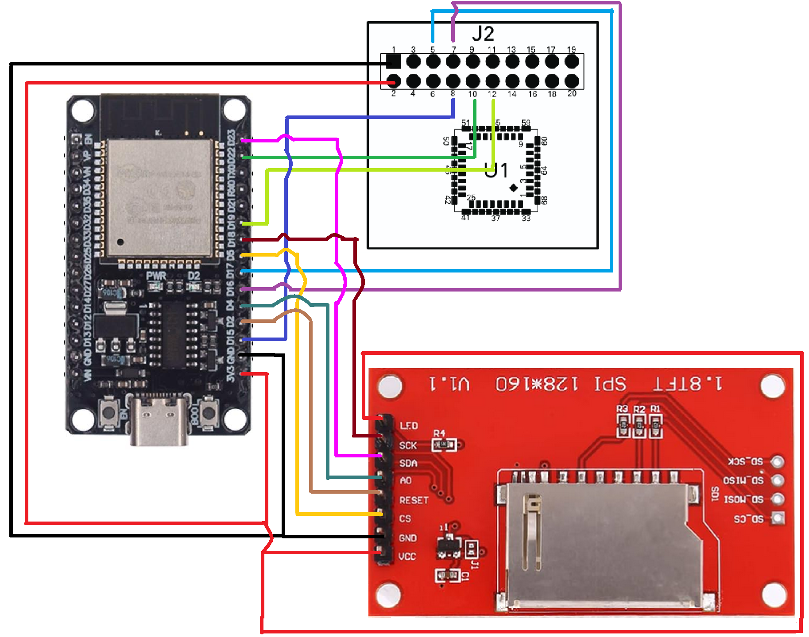

# Tiny Thermal Cam

## 

Huge thanks to [Jacob-Lundstrom](https://github.com/Jacob-Lundstrom/ESP-FLIR) for its repository. It was the only one that I could get working properly with my Lepton camera.

## Parts

- [ESP32](https://fr.aliexpress.com/item/1005006476877078.html)  
- [ST7735 Screen](https://www.amazon.fr/dp/B07BY2W1TQ)  
- [Lepton FLIR Breakout Board v2](https://mou.sr/3UNaF37)  
- [Lepton FLIR 3.1R](https://mou.sr/416S7OK)  

## Pinout

| ESP32 Pin | Lepton Pin | Function  |
|-----------|------------|-----------|
| D17       | Pin 5      | SDA       |
| D15       | Pin 8      | SCL       |
| D22       | Pin 10     | CS        |
| D16       | Pin 7      | SCK       |
| D19       | Pin 12     | MISO      |
| GND       | GND        | Ground    |
| 3V3       | Power In   | Power     |

| ESP32 Pin | ST7735 Pin | Function        |
|-----------|------------|-----------------|
| 3V3       | VCC        | Power           |
| GND       | GND        | Ground          |
| D5        | CS         | Chip Select     |
| D2        | RST        | Reset           |
| D4        | A0         | Command/Data    |
| D23       | SDA        | Data    (MOSI)  |
| D18       | SCK        | SPI Clock       |
| 3V3       | LED        | Backlight       |

## Code

Depending if you prefer accuracy over speed, you can choose different programms. [LEpton_grayscale_Ultra_fast.ino](https://github.com/Pi1lot/Tiny-Thermal-Cam/blob/main/LEpton_grayscale_Ultra_fast.ino) has the most FPS and is the most stable during use (almost no static, very few freezes), but temperatures are innacurate. If you prefer more accurate measurements, choose ...
